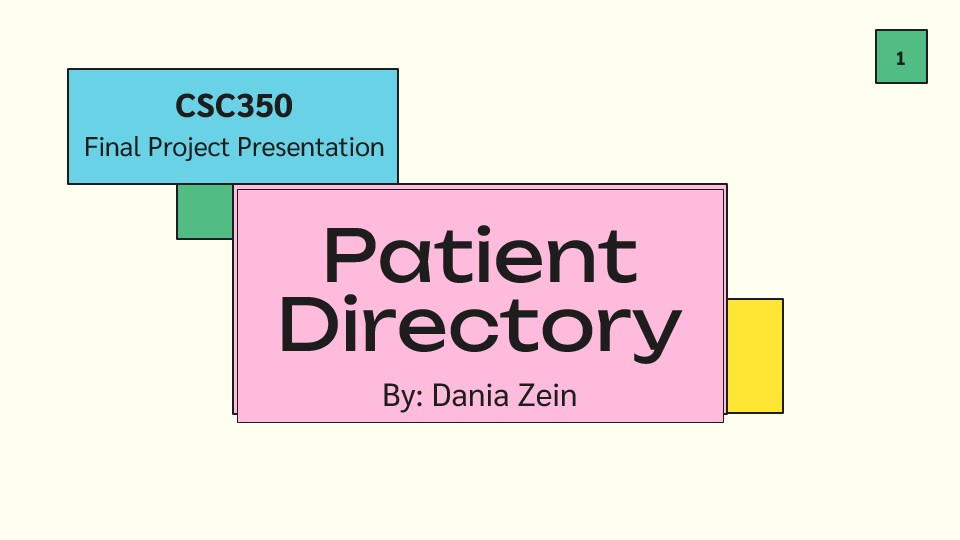
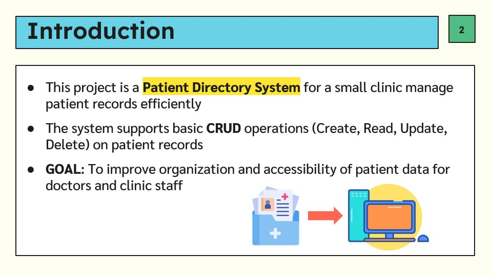
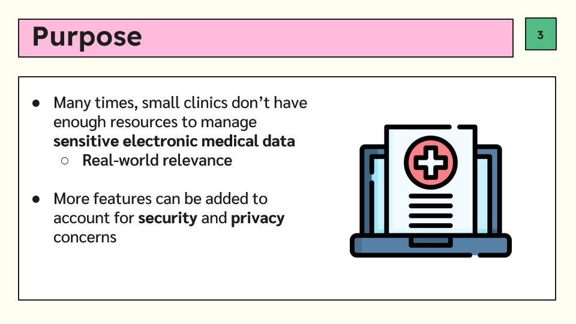
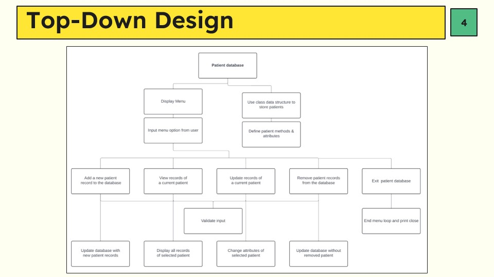
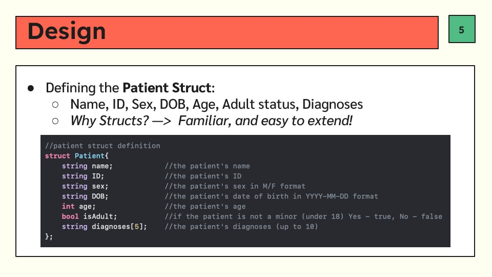
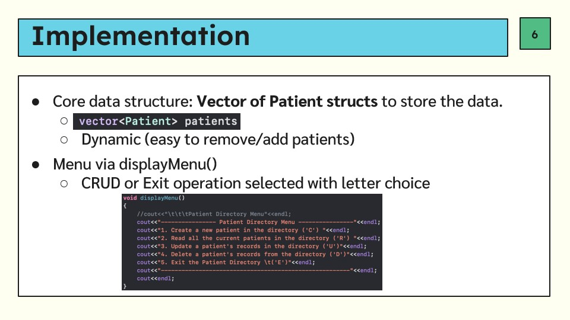
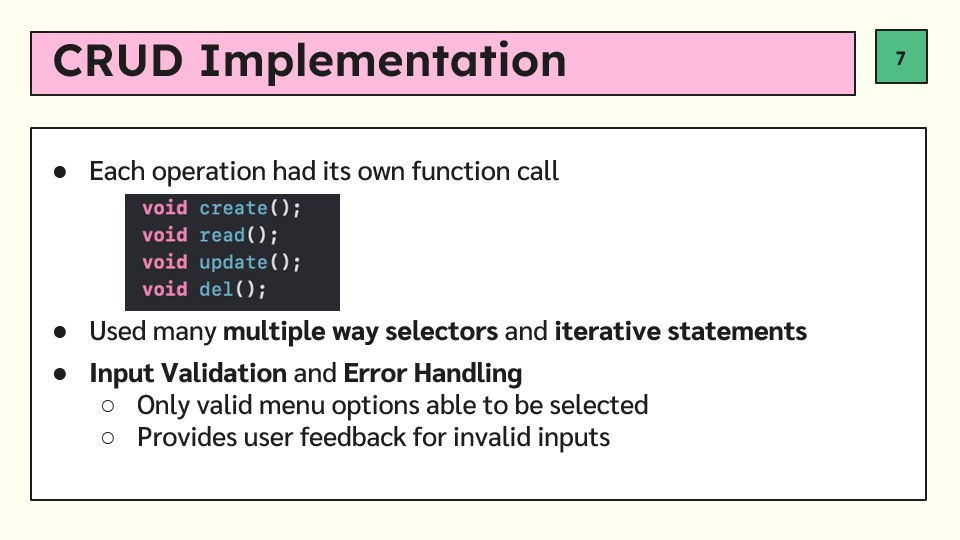
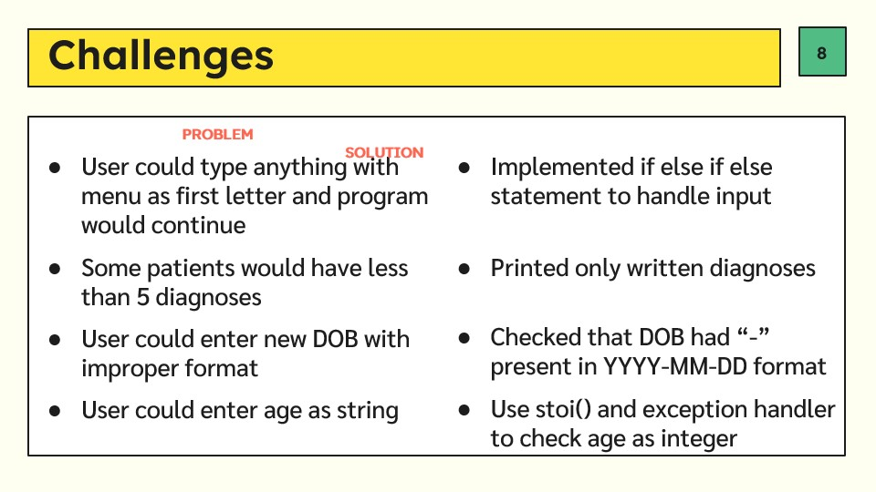
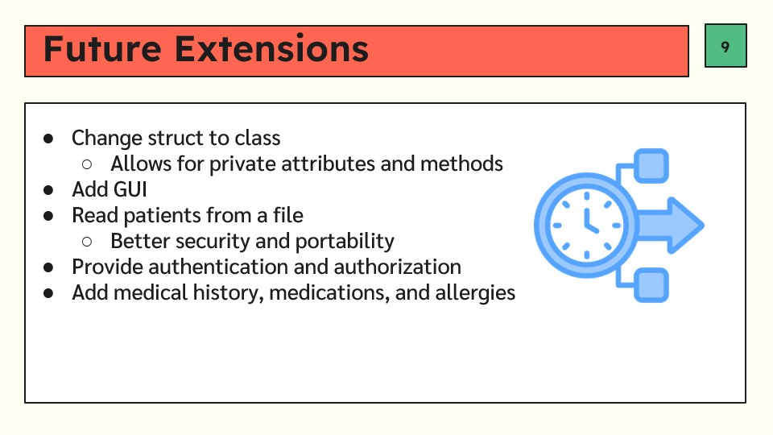
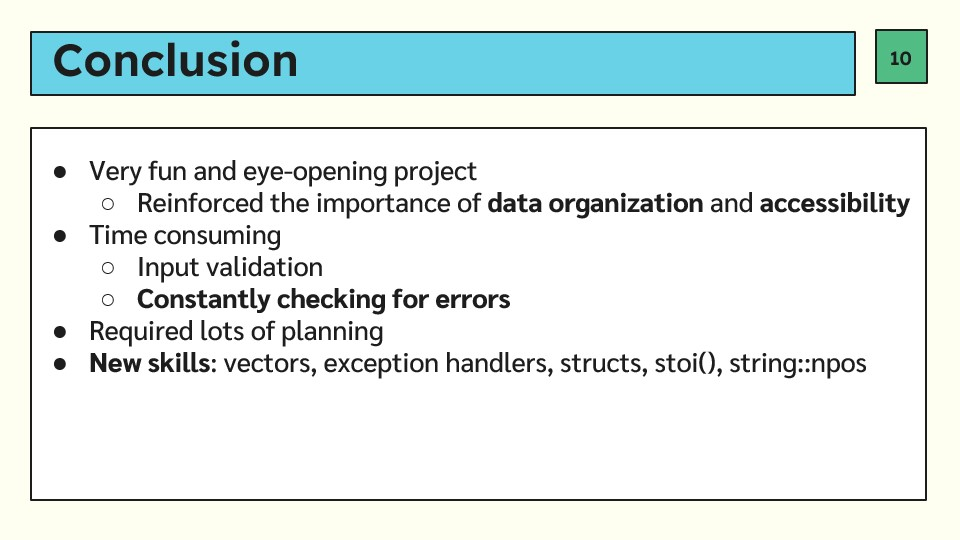

# Patient-Directory-System
This is my final programming project for CSC350. The patient directory system supports basic CRUD operations and is intended for a small clinic manage patient records efficiently. The goal is to improve organization and accessibility of patient data.

